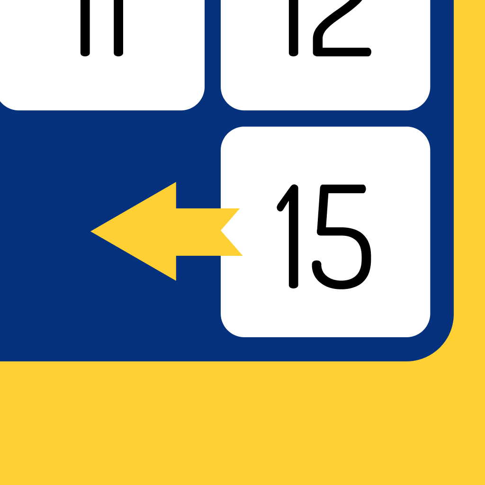
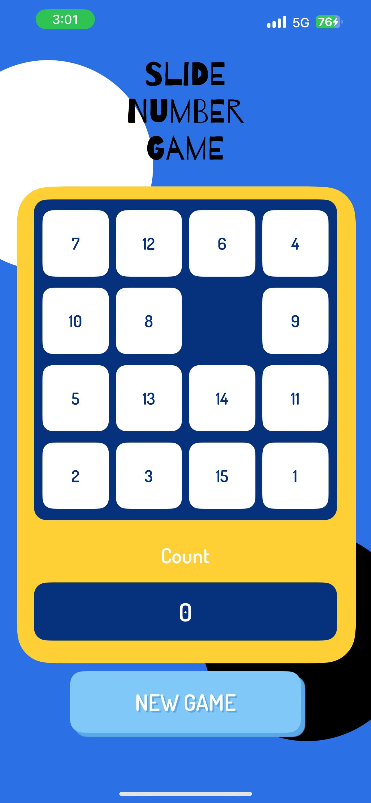
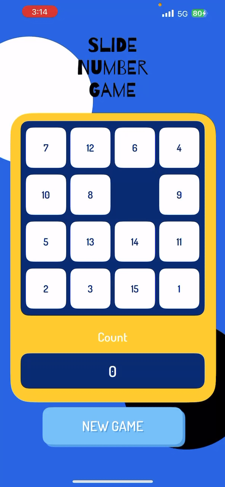

First Readme
<a name="readme-top"></a>
> Thanadon Boontawee - 6410685165 - AS2
<!-- PROJECT LOGO -->
<br />
<div align="center">
  <a href="https://github.com/fusethnd/slidenumber">
    
  </a>

<h3 align="center">Slide Number Game</h3>

  <p align="center">
    Game application for 15-Puzzle Game
    <br>
    <br />
    <a href="https://www.youtube.com/watch?v=dpzdKCzgE-U">📲 Demo Video </a>
    ·
    <a href="https://github.com/fusethnd/slidenumber">📥 Repository </a>
    ·
    <a href="https://github.com/fusethnd/slidenumber/issues">👾 Report Bug </a>
  </p>
</div>

<br>


<!-- TABLE OF CONTENTS -->
<details>
  <summary>Table of Contents</summary>
  <ol>
    <li>
      <a href="#about-the-project">About The Project</a>
    </li>
    <li>
      <a href="#features">Features</a>
    </li>
    <li>
      <a href="#getting-started">Getting Started</a>
    </li>
    <li><a href="#how-to-play">How to Play</a></li>
    <li><a href="#contact">Contact</a></li>
  </ol>
</details>


<!-- ABOUT THE PROJECT -->
## About The Project
<div align="center">
  
</div>

This project is a Swift-based game where players can engage in a 15-puzzle slide number challenge. The goal of the game is to arrange the numbered tiles in numerical order, with the empty space at the bottom right corner. The tiles are usually numbered from 1 to 15, arranged in a 4x4 grid.


### Built With
[![Swift][Swift]][Swift-url]

<!-- FEATURES -->
## Features

- **Winning Alert:** After solving the puzzle correctly, the game provides feedback via alerts.

- **Round Tracking:** The game keeps track of the rounds slide to solve the puzzle in the game. This information is displayed while solving the puzzle.

- **Restart Functionality:** The game offers the option to restart, allowing players restart game and random a new puzzle if the players doesn't want to enjoy this puzzle anymore.

<!-- GETTING STARTED -->
## Getting Started

To run the project locally, follow these steps:

1. Clone the repository:

   ```bash
   git clone https://github.com/fusethnd/slidenumber.git
   ```

2. Open the Xcode project in the cloned repository.

3. Build and run the project on a simulator or a physical iOS device.

4. Enjoy playing the Number Guessing Game!


<!-- USAGE EXAMPLES -->
## How to Play
1. **Automatic Initialization:**
   - The game will automatically initialize the puzzle when you start. Tiles are scrambled, and your goal is to rearrange them.

    <div align="center">
      
    </div>

2. **Move the Tiles:**
   - Move tiles into the empty space by sliding them horizontally or vertically. Only the tile adjacent to the empty space can be moved to arrange the numbered tiles in numerical order within the 4x4 grid and leaving the empty space at the bottom right corner.

    <div align="center">
      
    </div>

3. **Start New Game:**
   - You can start a new game at any time, either during play or after successfully completing the puzzle. Use the "Start New Game" function to initiate a fresh puzzle.

    <div align="center">
      
    </div>


<!-- CONTACT -->
## Contact
Thanadon Boontawee - [@fusethnd](https://github.com/fusethnd) - [fusethnd\@gmail.com](mailto:fusethnd@gmail.com?subject=Test)

<br>

Here are some [🦜 party parrots](https://cultofthepartyparrot.com):

<div>
    
    
    
    
    
    
    
    
    
    
    
    
    
    
    
    
    
    
    
    
    
    
    
</div>

<!-- MARKDOWN LINKS & IMAGES -->
<!-- https://www.markdownguide.org/basic-syntax/#reference-style-links -->
[Swift]: https://img.shields.io/badge/Swift-FA7343?style=for-the-badge&logo=swift&logoColor=white
[Swift-url]: https://www.swift.org/
